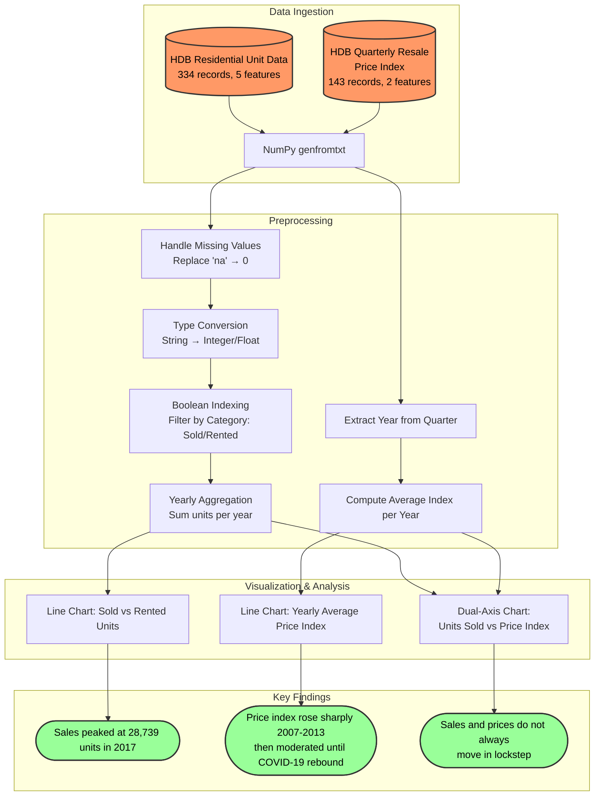

# Singapore HDB Market Trends Analysis

[](https://www.python.org/)
[](https://numpy.org/)
[](https://matplotlib.org/)

A data analysis project that investigates long-term trends in the Singapore HDB (Housing & Development Board) resale market using **NumPy** and **Matplotlib**. The analysis covers resale price index movements, unit sales vs rental volume dynamics, and the interplay between pricing and transaction volume across a 16-year period (2006–2021).

## 📊 Analysis Pipeline



## 📖 Project Overview

The Singapore HDB resale market is one of the most significant public housing markets in the world. This project analyzes two publicly available datasets to uncover trends in transaction volume and pricing, and to identify correlations (or lack thereof) between these metrics over time.

The analysis is conducted entirely using low-level data manipulation with **NumPy** arrays and visualization with **Matplotlib**, demonstrating proficiency in fundamental numerical computing.

## 🛠️ Methodology

### Data Preprocessing

1. **Data Loading**: Both CSV files are loaded using `numpy.genfromtxt()` with header skipping, stored as string-typed NumPy arrays for initial processing.
2. **Missing Value Handling**: The `no_of_units` column contains `'na'` entries, which are replaced with `'0'` using `numpy.where()` before integer conversion.
3. **Type Conversion**: Unit counts are cast to `int`, price indices to `float`.
4. **Boolean Indexing**: Records are filtered by category (`Sold` / `Rented`) using NumPy boolean array operations to compute per-year aggregates.
5. **Temporal Aggregation**: Quarterly price index data is grouped by year (extracting the first 4 characters of the quarter string) and averaged to produce yearly price index values.

### Visualization Approach

| Chart                          | Type              | Purpose                                                                                                        |
| :----------------------------- | :---------------- | :------------------------------------------------------------------------------------------------------------- |
| **Sold vs Rented Units**       | Dual-line chart   | Compare transaction volume trends between the two categories over time                                         |
| **Yearly Average Price Index** | Single-line chart | Track long-term price index movement with quarterly noise smoothed out                                         |
| **Units Sold vs Price Index**  | Dual-axis chart   | Overlay sales volume (left y-axis) against price index (right y-axis) to identify correlations and divergences |

## 🧠 Key Findings

- **Sales Volume Volatility**: The number of units sold exhibits significant year-over-year volatility, ranging from ~4,700 (2008) to ~28,700 (2017), driven by policy changes, economic conditions, and supply constraints.
- **Rental Market Stability**: Rental volumes remain remarkably stable (2,700–4,900 units/year), indicating that the rental segment serves as a consistent fallback during periods of high resale prices or limited supply.
- **Price-Volume Divergence**: Sales and prices do not always move in lockstep. During 2009–2013, both rose simultaneously (strong demand). In 2014, sales surged while prices stabilized, suggesting non-price factors (eligibility rules, loan accessibility) drive buyer behavior.
- **COVID-19 Impact**: The 2020–2021 period shows simultaneous increases in both sales volume and price index, attributed to BTO construction delays pushing demand into the resale market.
- **Policy Sensitivity**: Cooling measures (stricter loan eligibility, higher stamp duties) are visible in the data as periods of price moderation between 2015–2019.

## ⚙️ Backend Integration Potential

This analysis pipeline is well-suited for integration into a backend data service:

- **Automated Data Ingestion**: The NumPy-based CSV parsing can be replaced with scheduled API calls to [data.gov.sg](https://data.gov.sg/) for live HDB transaction data, feeding into a backend data pipeline.
- **REST API for Market Analytics**: The aggregation and trend computation logic can be wrapped in a FastAPI/Flask endpoint, serving real-time market trend data to frontend dashboards or mobile applications.
- **Time-Series Forecasting Extension**: The yearly aggregated data provides a clean foundation for integrating time-series forecasting models (e.g., ARIMA, Prophet) into a prediction microservice.

## 📊 Datasets

### HDB Residential Unit Data

Source: [data.gov.sg](https://data.gov.sg/)

- **334 records** with **5 columns**
- Covers financial years 2006–2021

| Column           | Type | Description                |
| :--------------- | :--- | :------------------------- |
| `financial_year` | int  | Year of transaction        |
| `property_type`  | str  | Always "HDB"               |
| `category`       | str  | Sold / Rented              |
| `flat_type`      | str  | 1-room to Executive flats  |
| `no_of_units`    | int  | Number of units transacted |

### HDB Quarterly Resale Price Index

Source: [data.gov.sg](https://data.gov.sg/)

- **143 records** with **2 columns**
- Covers 1990-Q1 to 2024-Q4

| Column    | Type  | Description                    |
| :-------- | :---- | :----------------------------- |
| `quarter` | str   | Year-Quarter (e.g., "2020-Q3") |
| `index`   | float | Resale price index value       |

## 🚀 Requirements

```bash
pip install numpy matplotlib
```

## 📂 Repository Structure

```
sg-hdb-market-trends/
├── sg_hdb_market_trends.ipynb          # Analysis notebook
├── hdb_residential_unit_data.csv       # HDB unit sales/rental data
└── hdb_quaterly_resale_price_index.csv # Quarterly resale price index
```

---

_Developed by Adita Putri Puspaningrum._
